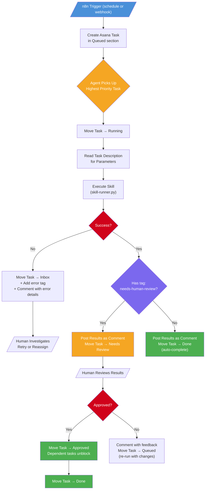
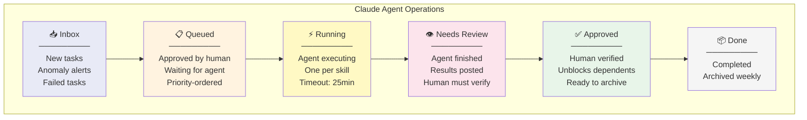
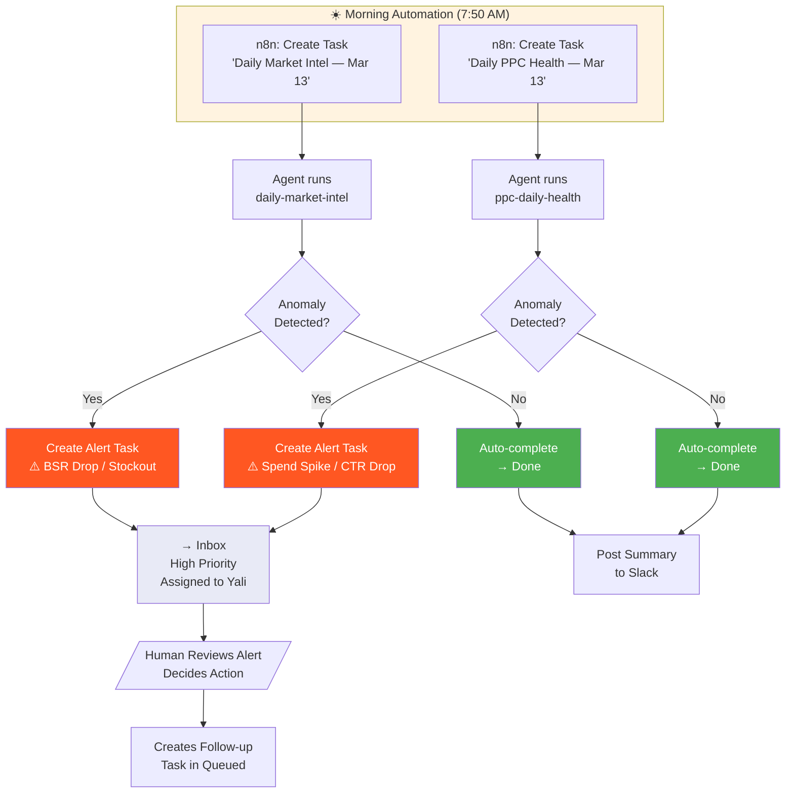
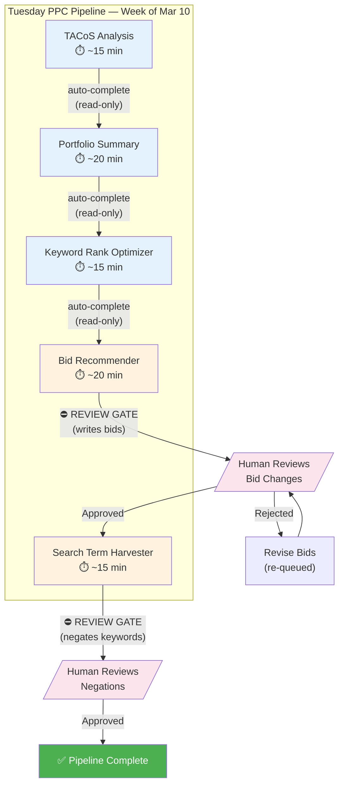
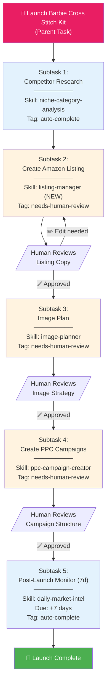
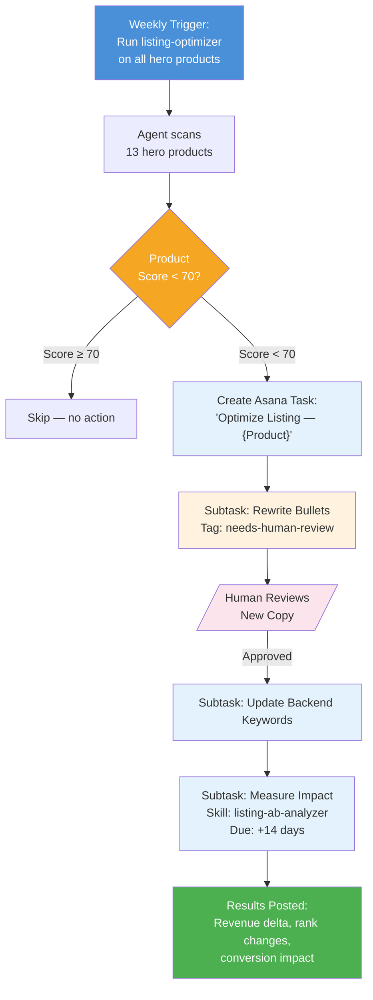
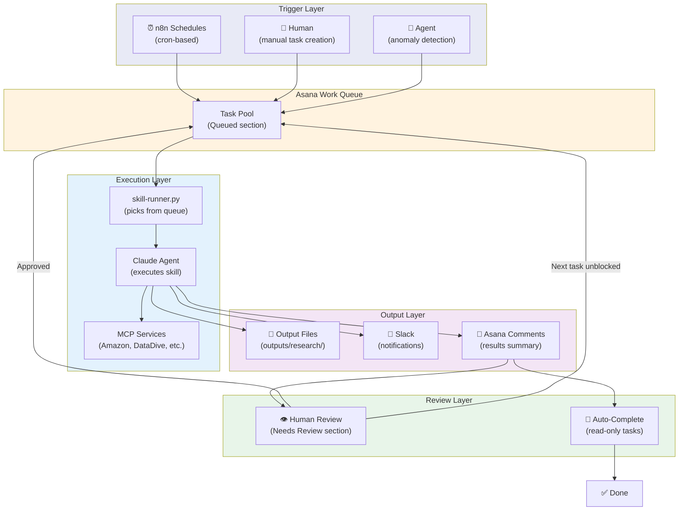

# Asana-Driven Agent Orchestration Plan

> **Date:** 2026-03-13 | **Status:** Planning | **Phase:** Architecture Design

---

## Vision

Transform Asana from a passive task tracker into the **central work queue** for all Claude agents. Every skill run becomes an Asana task with status tracking, human review gates, and dependency chains.

**Before:** `n8n schedule → skill-runner → Claude → Slack notification`
**After:** `n8n schedule → Asana task created → agent picks up → executes → updates Asana → human reviews → next task unblocks`

---

## Architecture Flowcharts

### 1. Core Agent Loop

### 2. Asana Project Board Structure

### 3. Daily Operations Flow

### 4. Tuesday PPC Pipeline (Dependency Chain)

### 5. Product Launch Workflow (Barbie Kits)

### 6. Listing Optimization Cycle

### 7. System-Wide Architecture

---

## Review Gate Policy

| Skill Type | Review Needed? | Rationale |
|------------|---------------|-----------|
| **Read-only analysis** (market-intel, PPC health, TACoS) | No — auto-complete | No risk, informational only |
| **Bid changes** (bid-recommender) | **Yes** | Money at stake, irreversible short-term |
| **Keyword negation** (search-term-harvester) | **Yes** | Can kill traffic to good terms |
| **Campaign creation** (ppc-campaign-creator) | **Yes** | Structural change, budget commitment |
| **Listing copy** (listing-manager, listing-optimizer) | **Yes** | Customer-facing, brand impact |
| **Image planning** (image-planner) | **Yes** | Drives photography/design spend |
| **Competitor research** (niche-analysis, review-analyzer) | No — auto-complete | No writes, pure research |

---

## Asana Custom Fields (Proposed)

| Field | Type | Values | Purpose |
|-------|------|--------|---------|
| `skill` | Dropdown | All 28 skill names | Which agent handles this |
| `priority` | Dropdown | Critical / High / Medium / Low | Queue ordering |
| `run-type` | Dropdown | Scheduled / Reactive / Manual | How the task was created |
| `review-gate` | Checkbox | True/False | Does human need to approve? |
| `parameters` | Text | JSON blob | Skill input (ASIN, portfolio, dates) |
| `output-path` | Text | File path | Where results were saved |
| `run-duration` | Number | Minutes | Execution time tracking |

---

## Implementation Phases

### Phase 1: Foundation (1 session)
- [ ] Create "Claude Agent Operations" project in Asana
- [ ] Set up 6 sections (Inbox → Queued → Running → Needs Review → Approved → Done)
- [ ] Create custom fields
- [ ] Create tags: `needs-human-review`, `auto-complete`, `anomaly`, `error`
- [ ] Build Asana helper functions in skill-runner.py

### Phase 2: Daily Skills (1-2 sessions)
- [ ] n8n creates Asana tasks for daily-market-intel and ppc-daily-health
- [ ] skill-runner reads from Asana queue instead of direct execution
- [ ] Auto-complete for routine runs, alert tasks for anomalies
- [ ] Slack notifications still fire (parallel to Asana)

### Phase 3: Dependency Chains (1 session)
- [ ] Tuesday PPC pipeline as linked Asana tasks with dependencies
- [ ] Review gates on bid-recommender and search-term-harvester
- [ ] n8n polls Approved section to trigger next skill

### Phase 4: Reactive Workflows (1 session)
- [ ] Skills create follow-up tasks on anomaly detection
- [ ] Product launch parent+subtask templates
- [ ] Listing optimization cycle with scheduled impact measurement

---

## Key Design Decisions

| Decision | Choice | Reasoning |
|----------|--------|-----------|
| Review gate default | **Opt-in** (tag-based) | Most runs are read-only; don't slow them down |
| Task creation | **n8n for scheduled, skills for reactive** | Clean separation of concerns |
| Parameters | **Custom fields for structured, description for context** | Parseable by agent + readable by human |
| Failure handling | **Move to Inbox + error tag** | Human decides retry vs. investigate |
| Slack integration | **Keep parallel** | Slack for quick alerts, Asana for tracking |
